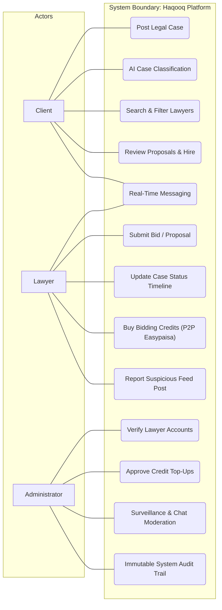
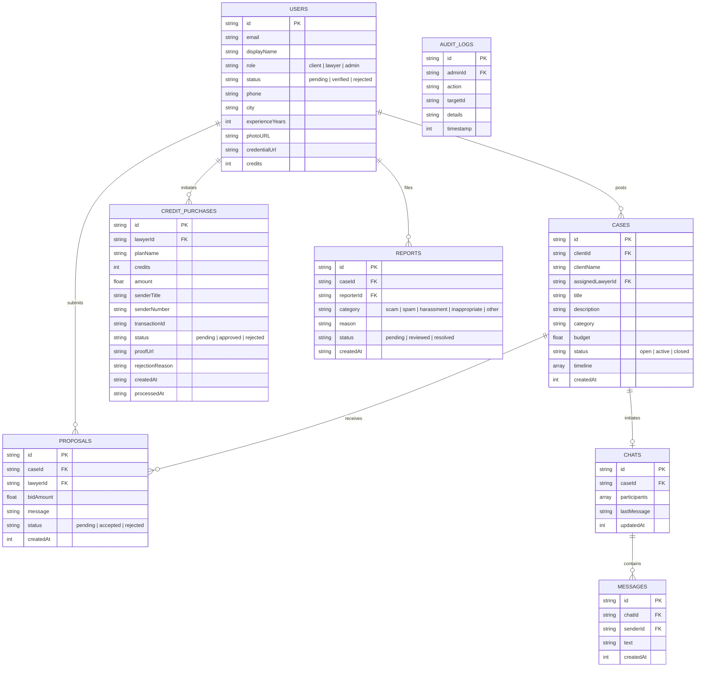
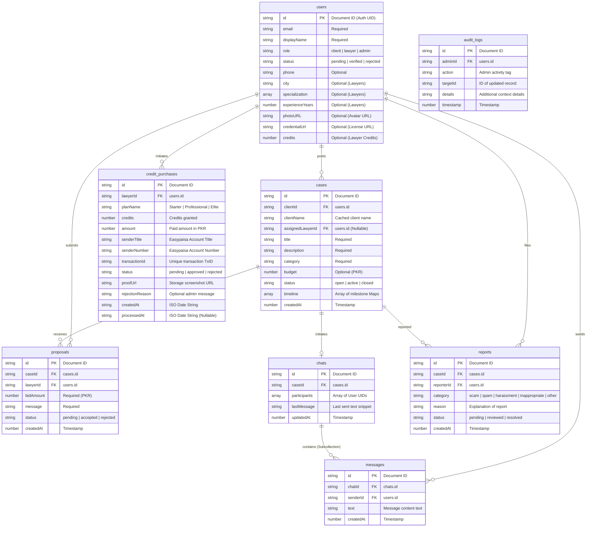
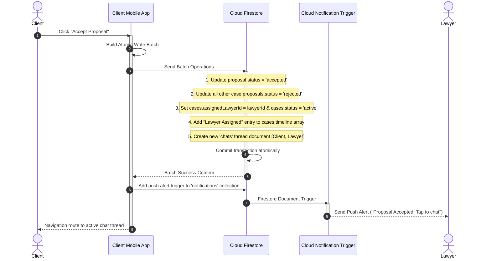
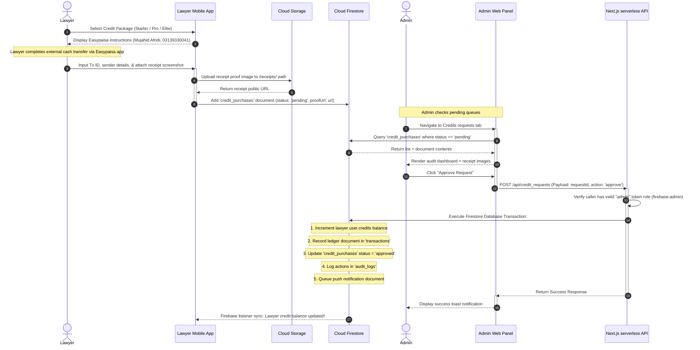
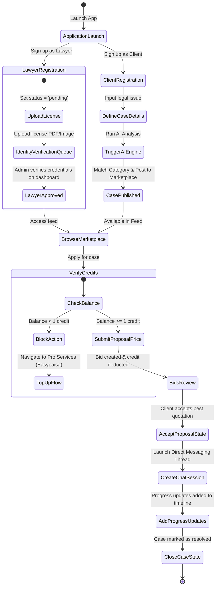

# Haqooq Platform - Technical Diagrams (Mermaid Specifications)

This file contains the raw Mermaid specifications for the Haqooq platform architecture, use cases, databases, and processes.

---

## 1. DATA FLOW DIAGRAM (DFD - LEVEL 1)

```mermaid
graph TD
    Client["Client (Mobile App)"]
    Lawyer["Lawyer (Mobile App)"]
    Admin["Administrator (Web Panel / Mobile Screen)"]
    Auth["Firebase Authentication (Role Validation)"]
    Firestore[("Cloud Firestore (NoSQL Document Store)")]
    Storage[("Firebase Cloud Storage (Object Bucket)")]

    %% Client Interactions
    Client -->|1. Sign in / Auth Token| Auth
    Client -->|2. Register / Update Profile Details| Firestore
    Client -->|3. Upload Avatar Image| Storage
    Client -->|4. Input Case Description (AI analysis)| Firestore
    Client -->|5. Accept Proposal (Escrow Lock Batch)| Firestore
    Client -->|6. Send Direct Messaging Data| Firestore

    %% Lawyer Interactions
    Lawyer -->|1. Sign in / Auth Token| Auth
    Lawyer -->|2. Register Specialization Details| Firestore
    Lawyer -->|3. Upload Identity / License Verification Docs| Storage
    Lawyer -->|4. Submit Bid Proposal (Deduct Credit)| Firestore
    Lawyer -->|5. Upload Easypaisa Receipt Screenshot| Storage
    Lawyer -->|6. Submit Credit Request (Pending state)| Firestore
    Lawyer -->|7. Update Case Timeline Progress Logs| Firestore

    %% Admin Interactions
    Admin -->|1. Sign in / Admin Verification check| Auth
    Admin -->|2. Fetch pending credentials & payment proofs| Firestore
    Admin -->|3. Approve / Reject lawyer verification docs| Firestore
    Admin -->|4. Approve / Reject credit requests (Web API check)| Firestore
    Admin -->|5. Read surveillance logs (Read-only chat spy)| Firestore
    Admin -->|6. Monitor compliance Audit Logs| Firestore
```

---

## 2. USE CASE DIAGRAM



---

## 3. ENTITY RELATIONSHIP (ER) DIAGRAM



---

## 4. DATABASE DESIGN (NOSQL COLLECTION SCHEMAS)

### Firestore NoSQL Database Schema Diagram



### Document Schema Specifications

#### 1. Collection: `users`
| Field Name | Data Type | Description |
| :--- | :--- | :--- |
| `id` | `string` | Unique user ID (Auth UID) |
| `email` | `string` | Account email address |
| `displayName` | `string` | Full name of the user |
| `role` | `string` | `client` \| `lawyer` \| `admin` |
| `status` | `string` | `pending` \| `verified` \| `rejected` |
| `phone` | `string` | Contact number |
| `city` | `string` | Operational city (Lawyers only) |
| `specialization` | `array [string]` | Legal domains (Lawyers only) |
| `experienceYears` | `number` | Experience years (Lawyers only) |
| `photoURL` | `string` | Avatar image link in Storage |
| `credentialUrl` | `string` | License proof PDF link in Storage |
| `credits` | `number` | Bidding credits (Lawyers only) |

#### 2. Collection: `cases`
| Field Name | Data Type | Description |
| :--- | :--- | :--- |
| `id` | `string` | Unique case ID |
| `clientId` | `string` | Client user ID (`users.id`) |
| `clientName` | `string` | Cached client display name |
| `assignedLawyerId`| `string` \| `null` | Assigned lawyer ID (`users.id`) |
| `title` | `string` | Headline of legal issue |
| `description` | `string` | Detailed case description |
| `category` | `string` | Matched legal domain |
| `budget` | `number` | Optional case budget (PKR) |
| `status` | `string` | `open` \| `active` \| `closed` |
| `timeline` | `array [map]` | Case milestones with description & date |
| `createdAt` | `number` | Timestamp of post |

#### 3. Collection: `proposals`
| Field Name | Data Type | Description |
| :--- | :--- | :--- |
| `id` | `string` | Unique proposal ID |
| `caseId` | `string` | Reference case ID (`cases.id`) |
| `lawyerId` | `string` | Reference lawyer ID (`users.id`) |
| `bidAmount` | `number` | Quoted fee in PKR |
| `message` | `string` | Proposal pitch description |
| `status` | `string` | `pending` \| `accepted` \| `rejected` |
| `createdAt` | `number` | Timestamp of submission |

#### 4. Collection: `chats`
| Field Name | Data Type | Description |
| :--- | :--- | :--- |
| `id` | `string` | Unique chat ID |
| `caseId` | `string` | Reference case ID (`cases.id`) |
| `participants` | `array [string]` | UIDs of participating client and lawyer |
| `lastMessage` | `string` | Text content of the last sent message |
| `updatedAt` | `number` | Unix timestamp of the last message update |

#### 5. Subcollection: `chats/{chatId}/messages`
| Field Name | Data Type | Description |
| :--- | :--- | :--- |
| `id` | `string` | Unique message ID |
| `chatId` | `string` | Reference chat ID (`chats.id`) |
| `senderId` | `string` | UID of message sender (`users.id`) |
| `text` | `string` | Text content of the message |
| `createdAt` | `number` | Unix timestamp of submission |

#### 6. Collection: `credit_purchases`
| Field Name | Data Type | Description |
| :--- | :--- | :--- |
| `id` | `string` | Unique purchase request ID |
| `lawyerId` | `string` | Reference lawyer ID (`users.id`) |
| `planName` | `string` | Name of credit plan (`Starter` \| `Professional` \| `Elite`) |
| `credits` | `number` | Number of credits awarded |
| `amount` | `number` | Total cost in PKR |
| `senderTitle` | `string` | Sender's Easypaisa account title |
| `senderNumber` | `string` | Sender's Easypaisa account phone number |
| `transactionId` | `string` | Unique external transaction reference ID |
| `status` | `string` | Approval state: `pending` \| `approved` \| `rejected` |
| `proofUrl` | `string` | URL link to receipt screenshot in Storage |
| `rejectionReason`| `string` \| `null` | Optional reason provided by Admin on rejection |
| `createdAt` | `string` | ISO Date/Time of creation |
| `processedAt` | `string` \| `null` | ISO Date/Time of admin action |

#### 7. Collection: `reports`
| Field Name | Data Type | Description |
| :--- | :--- | :--- |
| `id` | `string` | Unique report ID |
| `caseId` | `string` | Target reported case ID (`cases.id`) |
| `reporterId` | `string` | UID of reporting user (`users.id`) |
| `category` | `string` | Type: `scam` \| `spam` \| `harassment` \| `inappropriate` \| `other` |
| `reason` | `string` | Detailed statement for the report |
| `status` | `string` | Moderation state: `pending` \| `reviewed` \| `resolved` |
| `createdAt` | `number` | Unix timestamp of report submission |

#### 8. Collection: `audit_logs`
| Field Name | Data Type | Description |
| :--- | :--- | :--- |
| `id` | `string` | Unique audit log ID |
| `adminId` | `string` | UID of performing admin (`users.id`) |
| `action` | `string` | Description of administrative action |
| `targetId` | `string` | ID of the target resource (e.g. lawyer UID, transaction ID) |
| `details` | `string` | Human-readable action details |
| `timestamp` | `number` | Unix timestamp of action |

---

## 5. SEQUENCE DIAGRAM: PROPOSAL ACCEPTANCE FLOW



---

## 6. SEQUENCE DIAGRAM: MANUAL PAYMENT VERIFICATION FLOW



---

## 7. CLASS DIAGRAM

```mermaid
classDiagram
    class UserProfile {
        +String id
        +String email
        +String displayName
        +String role
        +String status
        +String phone
        +String photoURL
        +int credits
    }
    class LawyerProfile {
        +String city
        +String[] specialization
        +int experienceYears
        +String credentialUrl
        +boolean isPremium
        +float rating
    }
    UserProfile <|-- LawyerProfile

    class LegalCase {
        +String id
        +String clientId
        +String clientName
        +String assignedLawyerId
        +String title
        +String description
        +String category
        +float budget
        +String status
        +TimelineEvent[] timeline
        +int createdAt
    }

    class CaseProposal {
        +String id
        +String caseId
        +String lawyerId
        +float bidAmount
        +String message
        +String status
        +int createdAt
    }

    class CreditPurchase {
        +String id
        +String lawyerId
        +String planName
        +int credits
        +float amount
        +String senderTitle
        +String senderNumber
        +String transactionId
        +String status
        +String proofUrl
        +String rejectionReason
        +String createdAt
    }

    class AuthStore {
        +UserProfile user
        +boolean isLoading
        +setUser(UserProfile user)
        +setLoading(boolean loading)
        +logout()
    }

    class CaseService {
        +classifyCaseWithAI(String desc)
        +postCaseToMarketplace(String clientId, String clientName, String title, String description, String category, float budget)
        +acceptProposal(String proposalId, String caseId, String lawyerId, String clientId, float amount)
        +closeCase(String caseId, String closedBy)
    }

    class MarketplaceService {
        +getOpenCases()
        +submitProposal(String caseId, String lawyerId, float bidAmount, String message)
        +getLawyerBiddedCaseIds(String lawyerId)
        +reportCase(String caseId, String reporterId, String reason)
    }

    class AdminService {
        +getAdminStats()
        +getPendingLawyers()
        +approveLawyer(String lawyerId)
    }
```



---

## 8. ACTIVITY DIAGRAM


